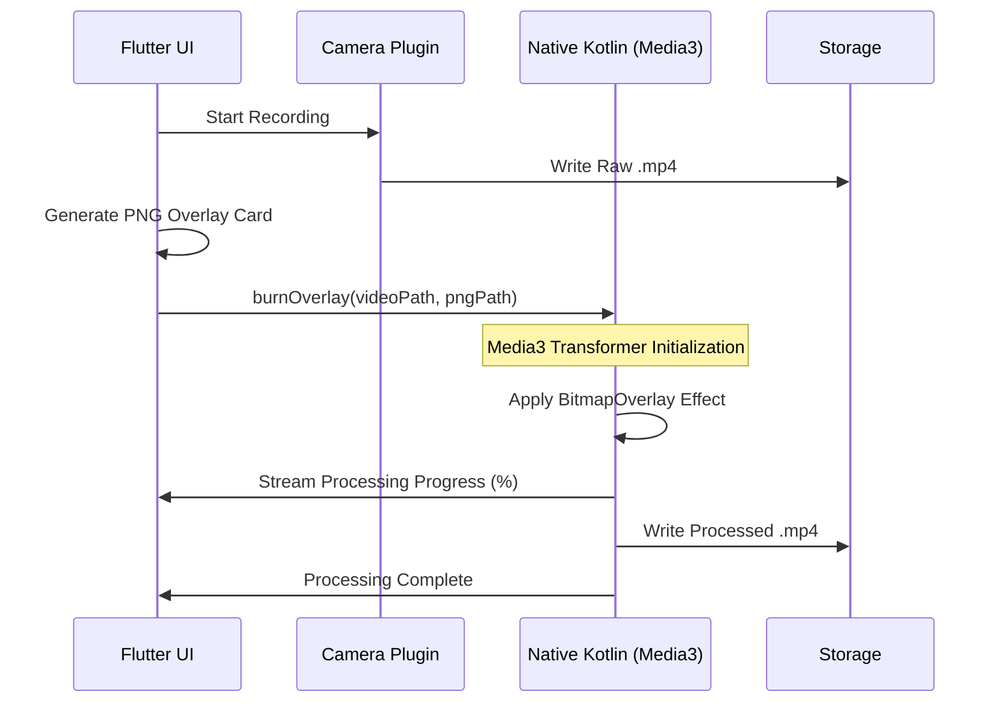

# Geo Tag Camera App

A premium Flutter application for high-performance geotagged photography and video recording.

---

## 🧭 Documentation Portal

| Document | Purpose | Audience |
| :--- | :--- | :--- |
| **[README.md](file:///e:/SAHIL%20SHINDE/Geo%20Tag/gps_map_camera_app/gps_map_camera_app/README.md)** | Overview & Quick Start | All Users |
| **[TECHNICAL_GUIDE.md](file:///e:/SAHIL%20SHINDE/Geo%20Tag/gps_map_camera_app/gps_map_camera_app/TECHNICAL_GUIDE.md)** | Algorithms & Native Bridge | Developers |
| **[OPS_AND_SETUP.md](file:///e:/SAHIL%20SHINDE/Geo%20Tag/gps_map_camera_app/gps_map_camera_app/OPS_AND_SETUP.md)** | Permissions & Ops | DevOPS / Admin |

---

## 🌟 Feature Matrix

| Feature | Description | Platform | Tech Used |
| :--- | :--- | :--- | :--- |
| **Geotagged Photo** | Saves GPS into EXIF headers | iOS/Android | Native ExifInterface |
| **Muxed Video** | Burns overlays into MP4 | Android | Media3 Transformer |
| **Doc Scanner** | Auto-crop & Perspective Warp | Cross-Platform | DLT Homography |
| **OCR** | Extract text from Images | Cross-Platform | Google ML Kit |
| **Data Export** | PDF, Excel, GPX, KML | Cross-Platform | Local File IO |

---

## 🔄 Core Data Flow

### Video Overlay Processing
This diagram shows how the app "burns" geotag data into a final video file using the native hardware acceleration pipeline.

---

## 🚀 Quick Start

### Prerequisites
- **Flutter SDK**: `^3.3.0`
- **Firebase Project**: Configured via the [Firebase Console](https://console.firebase.google.com/).

### Installation
1.  **Pub Get**: `flutter pub get`
2.  **Firebase**: Place `google-services.json` in `android/app/`.
3.  **Run**: `flutter run`

---

## 📁 Project Structure

- `lib/features/`: UI and modular logic.
- `lib/data/`: Central services (GPS, IO, Auth).
- `android/`: Native Android processing logic.

---

## 📄 License
This project is licensed under the MIT License.
